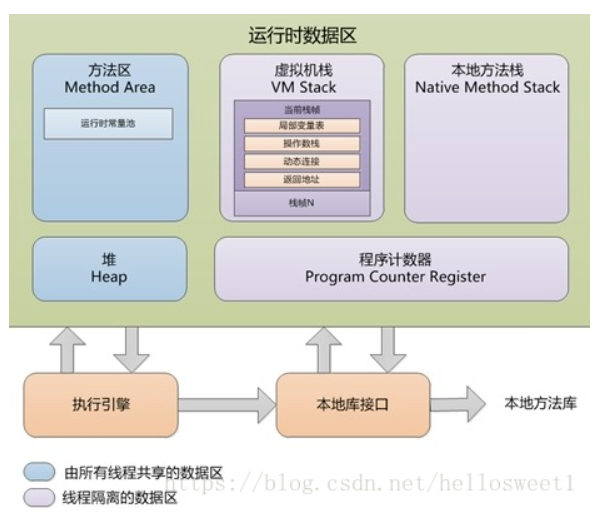

#一、JVM运行时数据区
&emsp;&emsp;一般来讲JAVA内存结构说的是JVM运行时数据区的结构。 
&emsp;&emsp;JVM运行时数据区包含以下几个部分：虚拟机栈（VM Stack）、本地方法栈（Native Method Stack）、堆（Heap）、方法区（Method Area）、程序计数器（Program Counter Register）。 
&emsp;&emsp;其中，虚拟机栈、本地方法栈、程序计数器是线程私有的，堆、方法区是所有线程共享的。

##1、程序计数器
&emsp;&emsp;简单的说就是告诉虚拟机下一条执行指令是什么。
&emsp;&emsp;此内存区域是唯一一个在java虚拟机规范中没有规定任何OutOfMemoryError情况的区域。
##2、JAVA虚拟机栈
##3、本地方法栈
##4、JAVA堆
##5、方法区
##6、运行时常量池
##7、直接内存
