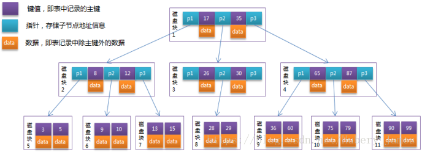
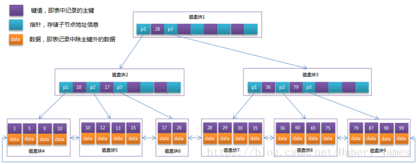

    关于各种类型的索引的相关知识待补充
    
    1、覆盖索引
    2、回表查询
    3、sql执行流程
    4、数据库优化方案
    5、索引失效的情况
    

#mysql索引
## 概念
&emsp;&emsp;索引是一种数据结构。用来快速的查找到表里边需要的数据。
## 索引类型
&emsp;&emsp;常见的索引类型有B+Tree索引，Hash索引，位图索引等。其中B+Tree最常见，innodb默认的索引类型也是B+Tree。
### B-Tree
&emsp;&emsp;B-Tree是一种多路平衡查找树。一棵m阶的B-Tree有如下特性： 
 * 每个节点最多有m个孩子。 
 * 除了根节点和叶子节点外，其它每个节点至少有Ceil(m/2)个孩子。 
 * 若根节点不是叶子节点，则至少有2个孩子 
 * 所有叶子节点都在同一层，且不包含其它关键字信息 
 * 每个非终端节点包含n个关键字信息（P0,P1,…Pn, k1,…kn） 
 * 关键字的个数n满足：ceil(m/2)-1 <= n <= m-1 
 * ki(i=1,…n)为关键字，且关键字升序排序。 
 * Pi(i=1,…n)为指向子树根节点的指针。P(i-1)指向的子树的所有节点关键字均小于ki，但都大于k(i-1)
 
 
 在这里重要的特点有：
 * 除了叶子节点外，子节点的值得大小包含在节点值之内。
 * 数据存储在每个节点上
 
### B+Tree
&emsp;&emsp;B+Tree也是一种多路平衡查找树，是对B-Tree的一种优化。B+Tree相对于B-Tree有几点不同：
 * 非叶子节点只存储键值信息
 * 所有叶子节点之间有一个指针链相连
 * 所有数据都存在叶子节点中
 
&emsp;&emsp;通常在B+Tree上有两个头指针，一个指向根节点，
 另一个指向关键字最小的叶子节点，而且所有叶子节点（即数据节点）之间是一种链式环结构。 
&emsp;&emsp;B+Tree相对于B-Tree能更充分的利用节点空间，查询速度稳定，范围查询时更高效。
### Hash
&emsp;&emsp;Hash索引底层是哈希表，哈希表是一种以key-value存储数据的结构，
所以多个数据在存储关系上是完全没有任何顺序关系的，因此哈希索引没办法利用索引完成排序。
具有等值查询效率高，范围查询效率低的特点。
哈希索引不支持多列联合索引的最左匹配规则，如果有大量重复键值得情况下，哈希索引的效率会很低，因为存在哈希碰撞问题。
 
##1、索引分类
&emsp;&emsp;mysql索引分为 普通索引、唯一索引、主键索引、组合索引、全文检索。 
&emsp;&emsp;索引不会包含有null值的列，索引项可以为null（唯一索引、组合索引等），
但是只要列中有null值就不会被包含在索引中。

    关于索引列有null值的情况下索引生效情况待验证。// TODO 
###a 普通索引
&emsp;&emsp;基本的索引类型，没有唯一性限制，值可以为空。 
&emsp;&emsp;create index index_name on table(column); 
&emsp;&emsp;或者在创建表的时候创建：create table(..., index index_name column);
###b 唯一索引
&emsp;&emsp;类似普通索引，但是索引列的值必须唯一,值可以为空。 
&emsp;&emsp;create unique index index_name on table(column); 
&emsp;&emsp;或者创建表时指定unique index_name column;
###c 主键索引
&emsp;&emsp;特殊的唯一索引，不允许为空，索引列值唯一，一般是在建表是指定。primary key(column)，一张表只能有一个主键。
###d 组合索引
&emsp;&emsp;在多个字段上创建索引，遵循最左前缀原则。alter table t add index index_name(a,b,c);
    
    联合索引是否生效问题
###e 全文索引
&emsp;&emsp;主要用来查找文本中的关键字，不是直接与索引中的值相比较，像是一个搜索引擎，
配合match against使用，现在只有char，varchar，text上可以创建全文索引。
在数据量较大时，先将数据放在一张没有全文索引的表里，
然后再利用create index创建全文索引，比先生成全文索引再插入数据快很多。

##聚簇索引与非聚簇索引
&emsp;&emsp;innodb B+Tree索引的叶子节点上存储的数据有可能是不同的。当叶子节点存储的是整行数据时，叫做聚簇索引。
当叶子结点存储的是主键的值时，叫做非聚簇索引（二级索引）。 
&emsp;&emsp;聚簇索引减少了磁盘I/O，使数据访问更快。 
&emsp;&emsp;无法同时把数据行存在两个不同的地方，所以一个表只能有一个聚簇索引。
聚簇索引由存储引擎负责实现，不是所有的存储引擎都支持，其中innodb是通过主键聚集数据（就是说innodb中只有主键是聚簇索引）。 
&emsp;&emsp;聚簇索引缺点：
 * 插入速度严重依赖插入顺序，按照主键的顺序插入是速度最快的方式
 * 更新聚簇索引的代价很高，因为会将每个被更新的行移动到新的位置
 * 可能面临页分裂的问题，当插入到某个已满的页中时，存储引擎会将该页分裂成两个页面，导致表占用更多的磁盘空间。
 * 可能导致全表扫描变慢，由于页分裂导致数据储存不连续
 * 二级索引访问需要两次索引查找
 
##最左前缀法则
 
##覆盖索引

##sql执行流程

##数据库优化 

##sql执行计划

##2、什么时候使用索引

    MySQL每次查询只使用一个索引。与其说是“数据库查询只能用到一个索引”，倒不如说，和全表扫描比起来，去分析两个索引B+树更加耗费时间。所以where A=a and B=b这种查询使用（A，B）的组合索引最佳，B+树根据（A，B）来排序。

    （1）主键，unique字段；

    （2）和其他表做连接的字段需要加索引；

    （3）在where里使用＞，≥，＝，＜，≤，is null和between等字段；

    （4）使用不以通配符开始的like，where A like 'China%'；

    （5）聚集函数MIN()，MAX()中的字段；

    （6）order by和group by字段；

##3、什么时候不适用索引
    （1）表记录太少；

    （2）数据重复且分布平均的字段（只有很少数据值的列）；

    （3）经常插入、删除、修改的表要减少索引；

    （4）text，image等类型不应该建立索引，这些列的数据量大（假如text前10个字符唯一，也可以对text前10个字符建立索引）；

    （5）MySQL能估计出全表扫描比使用索引更快时，不使用索引；

##4、索引什么时候失效
    （1）组合索引未使用最左前缀，例如组合索引（A，B），where B=b不会使用索引；

    （2）like未使用最左前缀，where A like '%China'；

    （3）搜索一个索引而在另一个索引上做order by，where A=a order by B，只使用A上的索引，因为查询只使用一个索引 ；

    （4）or会使索引失效。如果查询字段相同，也可以使用索引。例如where A=a1 or A=a2（生效），where A=a or B=b（失效）

    （5）如果列类型是字符串，要使用引号。例如where A='China'，否则索引失效（会进行类型转换）；

    （6）在索引列上的操作，函数（upper()等）、or、！=(<>)、not in等；

##5、explain详解

      type字段为All，未使用索引；为ref，使用索引

      ALL                  全表扫描

      index                索引全扫描

      range               索引范围扫描，常用语<,<=,>=,between等操作

      ref                    使用非唯一索引扫描或唯一索引前缀扫描，返回单条记录，常出现在关联查询中

      eq_ref               类似ref，区别在于使用的是唯一索引，使用主键的关联查询

      const/system    单条记录，系统会把匹配行中的其他列作为常数处理，如主键或唯一索引查询

      null                   MySQL不访问任何表或索引，直接返回结果

 

      还有key字段表示用到的索引，没有用到为null 
        
    ----------------待补充-------------

&emsp;&emsp;
&emsp;&emsp;
&emsp;&emsp;
&emsp;&emsp;
&emsp;&emsp;
&emsp;&emsp;
&emsp;&emsp;
&emsp;&emsp;
&emsp;&emsp;
&emsp;&emsp;
&emsp;&emsp;
&emsp;&emsp;
&emsp;&emsp;
&emsp;&emsp;
